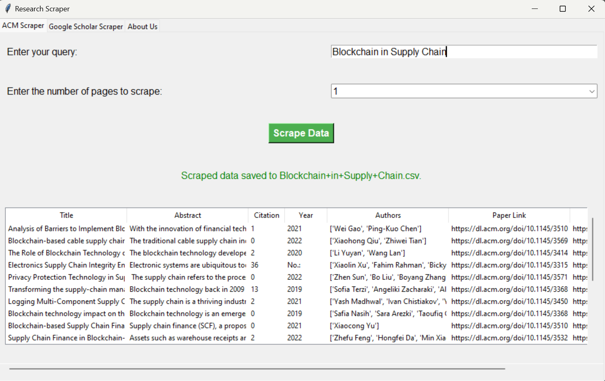

# researchScrapper
This scrapper allows you to scrape paper from Acm and google scholar and provide them as CSV as well as show in app.
1.	Download Code.py
2.	Open Terminal Write (python code.py)
3.	Choose ACM or Google Scholar
4.	Enter search queries
5.  Click "Scrape"

